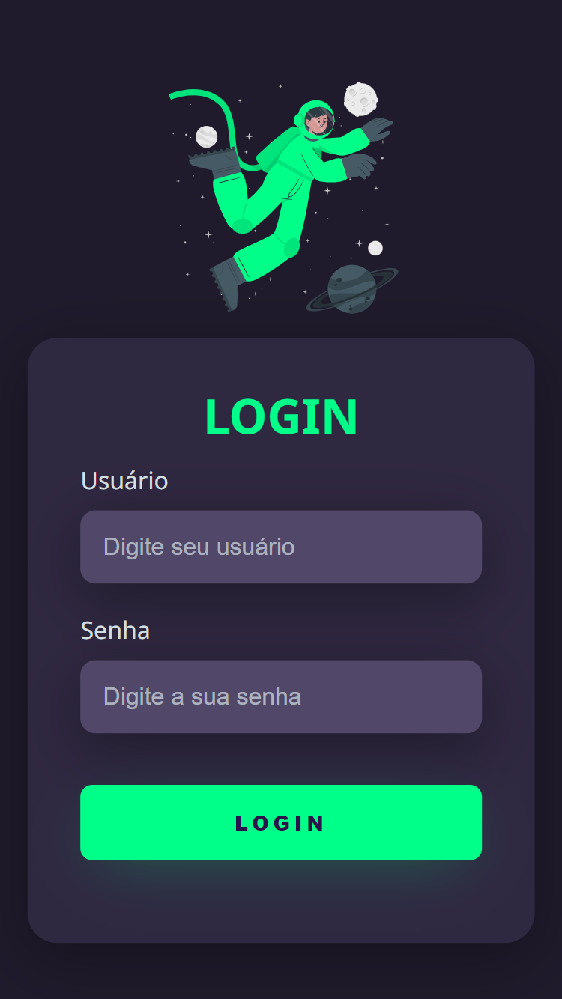

# Tela de Login

>Tela de Login Responsiva

Projeto feito seguindo um vídeo tutorial que encontrei no YouTube. A imagem com animação veio do site storyset.com.

[🔗 Clique aqui e veja como ficou]()

[🔗 Link do vídeo](https://www.youtube.com/watch?v=69-WfrVBli8&list=WL&index=10&ab_channel=Markzuel)

## 🛠 Tecnologias

- HTML
- CSS
- GIT
- GitHub
- Netlify

Obs: durante o evento foi recomendado o uso do GitHub também para a hospedagem do site, mas preferi usar o Netlify pois já havia usado anteriormente para outro projeto.

## 💬 Contato

Likedin: https://www.linkedin.com/in/igor-leandro-5a22531a2/