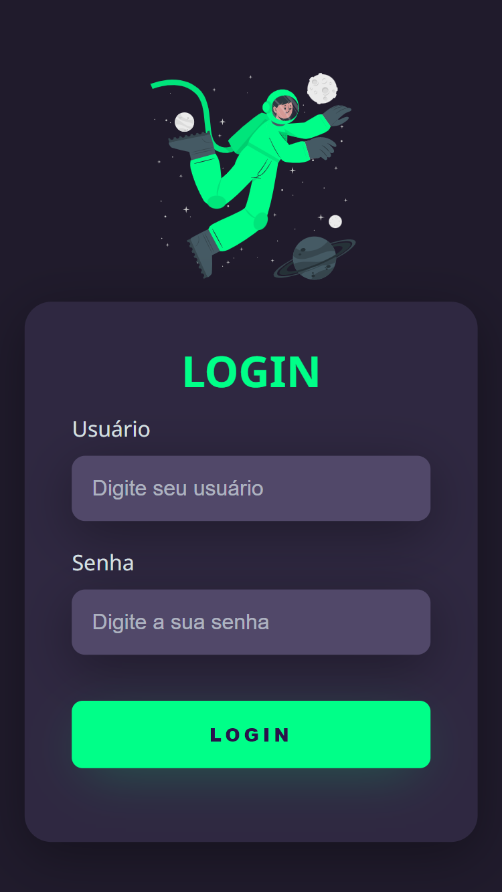

# Tela de Login Responsiva com Tema Escuro

>Tela de Login

Projeto feito seguindo um vídeo tutorial que encontrei no YouTube. A imagem com animação veio do site [Storyset](https://storyset.com).

[🔗 Clique aqui e veja como ficou](https://igorlrlteladelogin.netlify.app/)

[🔗 Link do vídeo](https://www.youtube.com/watch?v=69-WfrVBli8&list=WL&index=10&ab_channel=Markzuel)

## 🛠 Tecnologias

- HTML
- CSS
- GIT
- GitHub
- Netlify
## 💬 Contato

Likedin: https://www.linkedin.com/in/igor-leandro-5a22531a2/